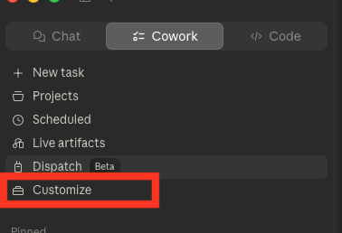
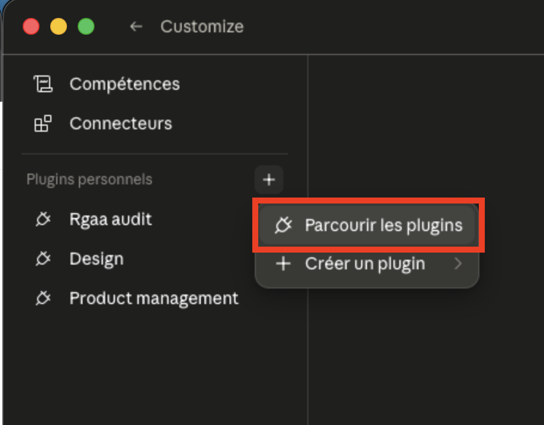
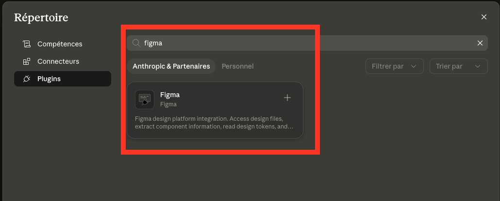
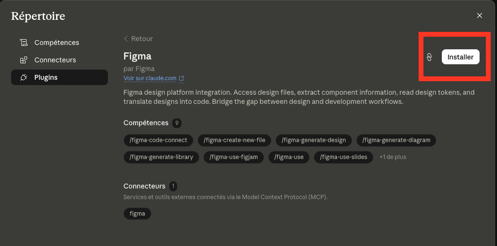

# brand-book · pipeline IA pour identités visuelles éditoriales

Skill Claude qui transforme un logo + quelques `.txt` sources en charte de marque complète, brand book Figma 15 slides, et landing page production-ready. Documenté avec le cas d'étude **fokusia** (graphiste freelance, identités visuelles pour cabinets d'investigation, avocats en cybercriminalité, entreprises de cybersécurité).

---

## Structure du repo

```
brand-book/
├── README.md
├── .gitignore
├── skill/                       ← LE SKILL RÉUTILISABLE
│   ├── SKILL.md                  (2700+ lignes, doc + règles)
│   ├── prerequis-legaux.md       (checklist brute LCEN + RGPD)
│   └── templates/                ← squelette projet prêt à copier
│       ├── description-services.txt
│       ├── infos-entreprise.txt
│       ├── temoignages-clients.txt
│       ├── logo/
│       │   └── README.md          (instructions de dépôt)
│       └── images/
│           ├── README.md
│           └── cas-clients/
│               ├── texte-cas-clients.txt
│               └── README.md
└── examples/
    └── fokusia/                  ← CAS D'ÉTUDE COMPLET
        ├── brand.md
        ├── landing-page.md
        ├── landing.html
        ├── landing-content.txt
        ├── description-services.txt    (rempli)
        ├── infos-entreprise.txt
        ├── temoignages-clients.txt
        ├── logo/
        │   ├── logo.svg
        │   └── logo-white.svg
        └── images/
            ├── hero.jpg
            ├── photo-profil.jpg
            └── cas-clients/
                ├── texte-cas-clients.txt
                ├── cas1.png
                ├── cas2.png
                └── cas3.png
```

Deux dossiers indépendants :

- **`/skill/`** — le pipeline réutilisable (skill Claude + templates vides). Tout ce qu'il faut pour démarrer un nouveau projet de marque.
- **`/examples/fokusia/`** — un cas d'étude complet, livrable de bout en bout. Sert de référence pour voir ce que produit le skill avec des inputs réels.

---

## Quick start

### 1. Cloner et copier les templates

```bash
git clone <ce-repo>
cp -r brand-book/skill/templates ~/mon-nouveau-projet
cd ~/mon-nouveau-projet
```

Tu obtiens un squelette de projet avec les 4 `.txt` vides à remplir et les sous-dossiers `logo/` et `images/cas-clients/` documentés par leur README.

### 2. Remplir les `.txt` sources

Éditer :

- `description-services.txt` — identité, promesse, persona, méthode, formule signature, objection #1, différenciateur, CTA
- `infos-entreprise.txt` — SIRET, hébergeur, mentions RGPD, URLs Calendly/LinkedIn, email
- `temoignages-clients.txt` — 3 verbatim clients avec attribution
- `images/cas-clients/texte-cas-clients.txt` — 3 cas projet phares

Tout `.txt` rempli skippe la vague d'interview correspondante du skill (gain de temps important).

### 3. Déposer les visuels

Coller :

- `logo/logo.svg` et `logo/logo-white.svg` (variantes couleur + blanche, exportées depuis Figma)
- `images/hero.jpg` (image principale, optionnel — fallback CSS sinon)
- `images/photo-profil.jpg` (portrait section About, optionnel)
- `images/cas-clients/cas1.png`, `cas2.png`, `cas3.png` (mockups des 3 cas, optionnel)

Le skill consomme tous ces fichiers automatiquement à la détection.

### 4. Lancer le skill

**Prérequis** : plugin Figma installé depuis le répertoire Claude (Settings → Répertoire → Plugins → "Figma" → Installer). Ce plugin fournit le connecteur remote Figma MCP avec droits d'écriture — sans lui, Claude ne peut pas créer de frames dans Figma.

Dans Claude (Cowork ou Claude Code), donner :

- L'URL du fichier Figma cible (avec les deux logos `Logo couleur` et `Logo blanc` collés sur Page 1)
- Le chemin du dossier projet
- (Optionnel) un trigger explicite : « scan ma charte », « brand setup complet », « fais le brand book », « génère la landing »

Le skill scanne le dossier, lit les `.txt`, pose uniquement les questions auxquelles il n'a pas trouvé de réponse (typo, univers visuel), et livre :

- `brand.md` — source de vérité de l'identité
- `landing-page.md` — brief structuré de landing
- `landing.html` — landing single-page production-ready
- `landing-content.txt` — textes IA-générés éditables
- Brand book Figma 15 slides 1920×1280

### 5. Éditer le contenu (mode SYNC)

Pour modifier un texte de la landing sans toucher au HTML :

1. Éditer `landing-content.txt` (textes IA) ou n'importe lequel des 4 `.txt` sources
2. Dire à Claude : « resynchronise la landing »
3. Claude relit tout, regénère `landing.html` en 3 secondes, sans interview

---

## Les 4 modes du skill

| Mode | Quand | Sortie |
|---|---|---|
| **CRÉATION** | `brand.md` absent, logo détecté | Phase A (interview ou pré-consommation `.txt`) + Phase B (Figma) |
| **BOOK** | `brand.md` présent, nouveau fichier Figma | Brand book Figma uniquement |
| **LANDING** | `brand.md` présent, trigger « refais la landing » | Régénération `landing-page.md` + `landing.html` |
| **SYNC** | `landing.html` + `landing-content.txt` présents, trigger « resynchronise » | Régénération rapide de `landing.html` depuis les `.txt` (zéro question) |

---

## Garanties production-ready

Le skill applique 5 règles bloquantes avant de livrer le HTML :

- **LOGO** — toujours le vrai SVG du dossier `./logo/`, jamais un wordmark recréé en CSS
- **IMAGES** — cascade de fallback en 3 niveaux (image locale > Unsplash hot-link > composition CSS riche), `` toujours présent dans le DOM
- **PRODUCTION-READY** — zéro `href="#"` orphelin, toutes les URLs réelles (Calendly, mailto, LinkedIn, mentions), `target="_blank" rel="noopener noreferrer"` sur les externes
- **ANIMATIONS** — easing éditorial `cubic-bezier(0.16, 1, 0.3, 1)`, stagger 0.1-0.15s, parallax léger sur hero, `prefers-reduced-motion` respecté
- **ANTI-AI-SLOP** — pas de gradients violet, pas de blobs colorés, pas de cards rounded-2xl shadow-xl génériques

Mentions légales et politique de confidentialité intégrées en accordions au pied de la landing (single-page, pas de fichiers HTML séparés), remplis depuis `infos-entreprise.txt`.

---

## Architecture des `.txt`

Pour gagner du temps d'interview, l'utilisateur prépare ces fichiers à l'avance. Le skill les détecte automatiquement (étape A.1.f du SKILL.md).

| Fichier | Contenu | Remplit |
|---|---|---|
| `description-services.txt` | Identité, promesse, persona, méthode (3 étapes), formule signature, objection #1, différenciateur, texte du CTA | Vagues 1, 2, 5 de l'interview |
| `infos-entreprise.txt` | SIRET, forme juridique, hébergeur, mentions RGPD, URLs Calendly/LinkedIn, email contact | Étape production-ready A.5.0.quater entièrement |
| `temoignages-clients.txt` | 3 verbatim clients avec attribution (fonction, lieu, année) | Section Témoignages |
| `images/cas-clients/texte-cas-clients.txt` | 3 cas : titre, secteur, année, brief original, ce qui a été livré | Section Portfolio |
| `landing-content.txt` *(écrit par le skill)* | Eyebrows, H1/H2 IA, intros, bullets, réponses FAQ Q2-Q5, sous-titres | Édition légère sans interview · mode SYNC |

Priorité des sources pour chaque variable : `.txt` > réponse interview > inférence brand.md > défaut documenté.

---

## Workflow détaillé

```
┌─────────────────────────────────────────────────────────────────┐
│  1. Préparation utilisateur                                     │
│     · Logo SVG dans Figma + dans /logo/                         │
│     · Remplir les 4 .txt sources (ou laisser vide → interview)  │
│     · Déposer hero.jpg, photo-profil.jpg, cas1-3.png (optionnel)│
└─────────────────────────────────────────────────────────────────┘
                              ↓
┌─────────────────────────────────────────────────────────────────┐
│  2. Skill · Phase A                                             │
│     · A.1 scan dossier + détection logos Figma                  │
│     · A.1.f pré-consommation des 4 .txt → variables internes    │
│     · A.2 interview (vagues skippées si .txt rempli)            │
│     · A.3 extraction tokens depuis logo                         │
│     · A.4 écriture brand.md                                     │
│     · A.5.0 → A.5.0.quater (questions structure, hero,          │
│       portfolio, production-ready)                              │
│     · A.5.a → A.5.f rédaction landing-page.md + lint            │
│     · A.5.g génération landing.html + landing-content.txt       │
└─────────────────────────────────────────────────────────────────┘
                              ↓
┌─────────────────────────────────────────────────────────────────┐
│  3. Skill · Phase B (Figma)                                     │
│     · 7 appels use_figma batchés                                │
│     · 15 slides 1920×1280 dans page « ✦ Brand Book »            │
│     · Variables couleur bindées (collection « Brand Tokens »)   │
│     · Logos clonés depuis Page 1 du Figma cible                 │
│     · QA visuelle automatique                                   │
└─────────────────────────────────────────────────────────────────┘
                              ↓
┌─────────────────────────────────────────────────────────────────┐
│  4. Édition continue · mode SYNC                                │
│     · User édite n'importe quel .txt                            │
│     · « resynchronise la landing » → regen landing.html         │
│     · 3 secondes, zéro question, idempotent                     │
└─────────────────────────────────────────────────────────────────┘
```

---

## Cas d'étude · fokusia

Le dossier `/examples/fokusia/` contient un livrable complet et cohérent :

- Identité visuelle premium pour cabinets de la discrétion corporate
- Palette teal `#0A2B32` + rouge focus `#E73737` chirurgical
- Typographie Playfair Display + Inter
- Persona dirigeants de cabinet d'investigation qui basculent vers le B2B
- Landing single-page de ~1700 lignes HTML, accessible WCAG AA, accordions mentions/confidentialité intégrés

Ouvre `/examples/fokusia/landing.html` dans ton navigateur pour voir le rendu final.

Tu peux dupliquer ce dossier comme point de départ pour un projet similaire (secteur premium / éditorial), remplacer logo + textes + images, et regénérer.

---

## Script workshop

Guide pas-à-pas pour animer ou suivre le workshop IA × Branding.

### 3 notions clés

**Le LLM — c'est le cerveau.**
Il prédit les mots suivants. Il sait presque tout… mais il ne connaît pas ta marque. Il a été entraîné sur des données publiques, pas sur tes intentions ni ton univers. C'est à toi de le nourrir.

**La skill — c'est une compétence.**
Un ensemble d'instructions pré-configurées pour que l'IA comprenne un contexte précis. La skill brand-book permet à Claude de comprendre ta marque, mémoriser son univers et s'adresser à elle de façon cohérente sur tous les supports.

**Le contexte — c'est la différence.**
Même question, 5 contextes différents = 5 résultats très différents. Plus tu donnes de contexte, plus l'IA est précise.

---

### Étape 1 — Configuration

**Connecter Figma à Claude**
Installer le plugin Figma depuis le répertoire Claude. Le plugin installe automatiquement le connecteur remote Figma MCP (avec droits d'écriture). C'est le seul setup nécessaire — pas de manipulation manuelle de connecteurs.

1. Dans la sidebar Cowork, cliquer sur **Customize**

   

2. Cliquer sur **+** à côté de "Plugins personnels", puis **Parcourir les plugins**

   

3. Chercher "figma" dans le Répertoire → onglet Plugins

   

4. Ouvrir la fiche Figma et cliquer **Installer**

   

Autoriser l'accès Figma dans la fenêtre qui s'ouvre. C'est terminé.

**Créer un projet Cowork**
Cowork → Nouveau projet → Utiliser un dossier existant. Sélectionner le dossier projet avec logo et images de marque.

**Télécharger le dossier modèle**
Si l'arborescence n'a pas été préparée en amont : télécharger le zip depuis GitHub, extraire, remplacer les fichiers de logo, sélectionner ce dossier dans Cowork.

**Installer la skill brand-book**
Customize → Compétences → +, glisser-déposer le fichier `.skill`. La skill apparaît dans la liste des compétences.

**Avant de lancer**
- Passer sur le modèle **Claude Opus 4.8**
- Ouvrir le fichier Figma avec le **logo couleur** et le **logo blanc** sur la Page 1

---

### Étape 2 — Lancer le brand book

Dans Figma, copier le lien du fichier. Dans Cowork, bien se placer dans le projet, puis taper :

```
/brand-book
```

Claude demande le lien Figma et un texte de contexte sur la marque. Coller le texte récapitulatif préparé en amont — quelques phrases sur l'univers, le ton, qui vous êtes.

---

### Étape 3 — Répondre aux questions

Claude pose trois vagues de questions pour définir l'identité. Plus les réponses sont précises, plus le brand book sera juste. Si toutes les réponses ne sont pas disponibles, répondre avec ce qui est connu — la commande `/brand-book` peut être relancée à tout moment avec des réponses affinées.

---

### Étape 4 — Le fichier brand.md

Claude génère `brand.md` : positionnement, promesse, différenciateur, identité visuelle. Ce fichier est entièrement modifiable. Deux usages possibles : référence interne pour soi-même, ou livrable client supplémentaire (identité formalisée en texte, réutilisable sur tous les supports).

---

### Étape 5 — Générer les images

Claude fournit une liste de **10 prompts prioritaires** construits à partir des réponses — univers visuel, valeurs, ton. Dans Figma : Make → Image, coller un prompt, choisir le moteur. Tester le même prompt avec deux moteurs pour voir lequel correspond le mieux à l'univers. Une fois les images générées, les coller dans les placeholders du brand book via **Cmd+R**.

---

### Étape 6 — Le brand book dans Figma

Claude crée une page "Brand" dans le fichier Figma avec 15 à 17 slides composées à partir des réponses, une palette de couleurs avec des variables Figma (modifier une variable met à jour tout le brand book), la typographie, les nuances, les modes de contraste, et les placeholders images.

---

### Étape 7 — Générer la landing page

Installer la skill **Frontend Design** : Customize → Compétences → +, glisser le fichier `.skill`. Ouvrir un nouveau chat dans Cowork, rester dans le projet, taper :

```
/frontend-design création de landing page
```

Claude s'appuie sur `brand.md` et `landing-page.md` pour générer une trame HTML complète.

---

### Étape 8 — Affiner la landing page

Ouvrir le fichier HTML dans Chrome. Pour les ajustements — textes, images, sections — les demander directement à Claude dans le chat. La landing peut être modifiée itérativement sans toucher au code.

---

### Étape 9 — Mettre en ligne avec Netlify

Créer un compte sur [netlify.com](https://netlify.com). Glisser-déposer le dossier projet dans l'interface. Le site est en ligne en quelques secondes avec une URL publique.

---

## Licence

Skill et code de pipeline · MIT. Cas d'étude fokusia (textes, identité, logo) · propriété d'Isabelle Marques, utilisable uniquement comme référence éditoriale dans le cadre de ce repo.

---

## Crédits

Skill conçu par [Arnaud Morvan](https://linkedin.com/in/arnaud-morvan-design) avec Claude. Cas d'étude **fokusia** par Isabelle Marques.

Itérations clés documentées dans l'historique des commits.
